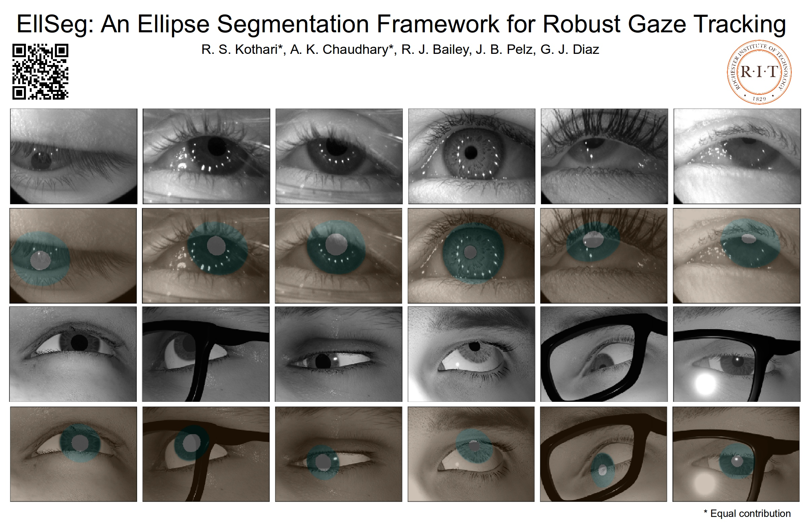

# EllSeg: An Ellipse Segmentation Framework for Robust Gaze Tracking

Please click the image to view video

[](https://youtu.be/rRhHXb-R-E8?t=7)

# Abstract
Ellipse fitting, an essential component in pupil or iris tracking based video oculography, is performed on previously segmented eye parts generated using various computer vision techniques. Several factors, such as occlusions due to eyelid shape, camera position or eyelashes, frequently break ellipse fitting algorithms that rely on well-defined pupil or iris edge segments. In this work, we propose training a convolutional neural network to directly segment entire elliptical structures and demonstrate that such a framework is robust to occlusions and offers superior pupil and iris tracking performance (at least 10% and 24% increase in pupil and iris center detection rate respectively within a two-pixel error margin) compared to using standard eye parts segmentation for multiple publicly available synthetic segmentation datasets.

# Pretrained models
EllSeg is a framework which can easily be replicated on any encoder-decoder architecture. To facilitate our work, we create a custom network nicknamed DenseElNet for which we provide trained models as reported in the [paper](https://arxiv.org/abs/2007.09600).

Trained on:

* OpenEDS
* NVGaze
* RITEyes
* LPW*
* Fuhl*
* PupilNet*
* All datasets (best for deploying)

To ensure stable training, starred models * were initialized with weights from a network pretrained on OpenEDS+NVGaze+RITEyes for 2 epochs. To replicate results on starred * sets,  please initialize with the following pretrained weights.

# Try it out on your eye videos!
For quick inference on your own eye videos, please use `evaluate_ellseg.py` as `python evaluate_ellseg --path2data=${PATH_EYE_VIDEOS}`. 

* `${path_eye_videos}`
	* exp_name_0 (can be anything)
		* eye0.mp4
		* eye1.mp4
	* exp_name_1
		* eye0.mp4

To visualize the output by ellipse fitting on the segmentation map, you can modify as `python evaluate_ellseg --path2data=${PATH_EYE_VIDEOS} --ellseg_ellipses=0`.

You may also turn outlier removal off by running the following code `python evaluate_ellseg --path2data=${PATH_EYE_VIDEOS} --ellseg_ellipses=0 --skip_ransac=1`.

Note the other flags and their (default values)


* `--vid_ext` (mp4) - Look out for videos with user decided extension
* `--save_maps` (False) - Save out segmentation output maps as H5 files (coming soon!)
* `--save_overlay` (True) - Save out segmentation output map on eye video
* `--eval_on_cpu` (False) - If no GPU available or found, EllSeg can also be evaluated using CPU
* `--load_file` (./weights/all.git_ok) - Choose a weight configuration. Default is *all* which was trained on a combination of all available datasets 
* `--check_for_string_in_fname` ('') - Only evaluate on videos with a user defined string. Example `--check_for_string_in_fname=eye` will evaluate on videos with <eye> within it

# Try it out on your eye images!
Coming soon!

# Pupil Labs integration
Coming soon! 

# Downloading datasets

Since we do not have access to publish or share other datasets, please download the following datasets and place them in `${DATA_DIR}/Datasets`. Links updated on 27/01/2021.

1. [ElSe + ExCuse](https://atreus.informatik.uni-tuebingen.de/seafile/d/8e2ab8c3fdd444e1a135/?p=%2Fdatasets-head-mounted&mode=list)
2. [PupilNet](https://atreus.informatik.uni-tuebingen.de/seafile/d/8e2ab8c3fdd444e1a135/?p=%2Fdatasets-head-mounted&mode=list)
3. [LPW](https://www.mpi-inf.mpg.de/departments/computer-vision-and-machine-learning/research/gaze-based-human-computer-interaction/labelled-pupils-in-the-wild-lpw/)
4.  [NVGaze](https://sites.google.com/nvidia.com/nvgaze)
5. [RITEyes](https://cs.rit.edu/~cgaplab/RIT-Eyes/)
6. [OpenEDS](https://research.fb.com/programs/openeds-challenge)

## Special data instructions

Combine images from `ElSe` and `ExCuSe` datasets into a common directory names `${DATA_DIR}/Datasets/Fuhl`. This combined dataset will henceforth be referred to as `Fuhl`. To ensure we use the latest pupil centers annotations, please use the files marked with `_corrected` and discard their earlier variants. Rename files as such `data set XXI_corrected.txt` to `data set XXI.txt`. Be sure to unzip image data. The expected hierarchy looks something like this:

* `Datasets`
	* `Fuhl`
		* `data set XXIII.txt`
		* `data set XXIII`
			* `0000000836.png`

Do **not** unzip the NVGaze synthetic dataset, it will consume a lot of wasteful resources and storage space. The code automatically extracts images via zip files. The expected hierarchy looks something like this:

## Convert datasets into common format

Once all datasets are placed in `${DATA_DIR}/Datasets`, please run the `ProcessDatasets.sh`. Please be sure to modify the variable `${DATA_DIR}`. This is a slow process, so please let it run overnight. This

# Code setup

This repository extracts datasets and converts all of them into a common format with labelled annotations. When a certain type of annotation is not present, you will generally find a `-1` or `NaN` entry. The code setup requires the following steps:

## Creating train and test splits

To ensure reproducibility, we predefine train and test splits for each dataset. Please refer to the paper for exact split specification. You may choose your own splits by modifying the following file. Please run the following command:
 `python /curObjects/datasetSelections.py`. 

## Creating train and test objects

To reproduce our results or for your own experiment, you need to create a train and test object for each dataset. This object contains all information required by the main program to find and process images from a dataset specific H5 file.

`python /curObjects/createDataloaders_baseline.py`

## Launching experiments

To launch your first experiment, you can edit and launch the following file. Please sure to change the train set as per your requirements. The code by default expects the train and test objects to be present in `./curObjects/baseline`

`./runLocal.sh`

## Testing a checkpoint model

Models which demonstrate best performance on a validation metric which combines segmentation, pupil and iris centers (see our paper for details) are saved out as `checkpoint.pt` files. Each checkpoint can be loaded by giving the appropriate paths to the testing script, `test.py`

`python test.py --expname=OpenEDS --model=ritnet_v3 --path2data=${DATA_DIR} --curObj=OpenEDS --loadfile=${PATH_TO_CHECKPOINT}/checkpoint.pt --disp=0`

You may alternatively switch the display flag on to visualize the output of EllSeg, similar to the following:


# Citations

If you only use our code base, please cite the following works
EllSeg 
```
@article{kothari2020ellseg,
  title={EllSeg: An Ellipse Segmentation Framework for Robust Gaze Tracking},
  author={Kothari, Rakshit S and Chaudhary, Aayush K and Bailey, Reynold J and Pelz, Jeff B and Diaz, Gabriel J},
  journal={arXiv preprint arXiv:2007.09600},
  year={2020}
}
```
RITEyes
```
@inproceedings{nair2020rit,
  title={RIT-Eyes: Rendering of near-eye images for eye-tracking applications},
  author={Nair, Nitinraj and Kothari, Rakshit and Chaudhary, Aayush K and Yang, Zhizhuo and Diaz, Gabriel J and Pelz, Jeff B and Bailey, Reynold J},
  booktitle={ACM Symposium on Applied Perception 2020},
  pages={1--9},
  year={2020}
}
```
Please cite and credit individual datasets at their own respective links.

# Questions?

Please email Rakshit Kothari at rsk3900@rit.edu
